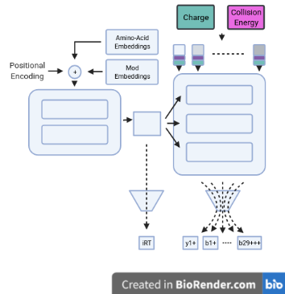
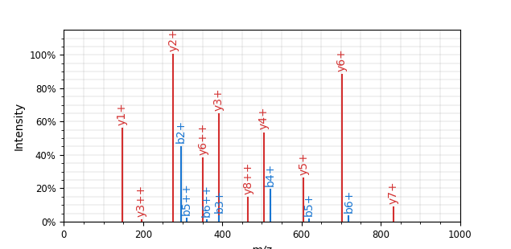

# ElFragmentador

## ElFragmentador

This repository attempts to implement a neural net that leverages the transformer architecture to predict peptide
properties (retention time and fragmentation).



## Usage

Currently the documentation lives here: [https://jspaezp.github.io/elfragmentador/](https://jspaezp.github.io/elfragmentador/)
Please check out [The Quickstart guide](https://jspaezp.github.io/elfragmentador/quickstart) for usage instructions.



## Why transformers?

Because we can... Just kidding

The transformer architecture provides several benefits over the standard approach on fragment prediction (LSTM/RNN). On the training side it allows the parallel computation of whole sequences, whilst in LSTMs one element has to be passed at a time. In addition it gives the model itself a better chance to study the direct interactions between the elements that are being passed.

On the other hand, it allows a much better interpretability of the model, since the 'self-attention' can be visualized on the input and in that way see what the model is focusing on while generating the prediction.

## Inspiration for this project

Many of the elements from this project are actually a combination of the principles shown in the [*Prosit* paper](https://www.nature.com/articles/s41592-019-0426-7) and the [Skyline poster](https://skyline.ms/_webdav/home/software/Skyline/%40files/2019-ASBMB-Rohde.pdf) on some of the elements to encode the peptides and the output fragment ions.

On the transformer side of things I must admit that many of the elements of this project are derived from [DETR:  End to end detection using transformers](https://github.com/facebookresearch/detr) in particular the trainable embeddings as an input for the decoder and some of the concepts discussed about it on [Yannic Kilcher's Youtube channel](https://youtu.be/T35ba_VXkMY) (which I highly recommend).

## Why the name?

Two main reasons ... it translates to 'The fragmenter' in spanish and the project intends to predic framgnetations. On the other hand ... The name was free in pypi.

## Resources on transformers

- An amazing illustrated guide to understand the transformer architecture: <http://jalammar.github.io/illustrated-transformer/>
- Another amazing guide in video format exlpaining the architecture "Illustrated Guide to Transformers Neural Network: A step by step explanation": <https://www.youtube.com/watch?v=4Bdc55j80l8>
- Full implementation of a transformer in pytorch with the explanation of each part: <https://nlp.seas.harvard.edu/2018/04/03/attention.html>
- Official pytorch implementation of the transformer: <https://pytorch.org/docs/stable/generated/torch.nn.Transformer.html>

## How fast is it?

You can check how fast the model is in you specific system.
Right now it tests only on CPU, message me if you need GPU inference times

```shell
poetry run pytest tests/test_model.py --benchmark-histogram 
```

Currenty the inference time in an Intel i5-7260U is ~5.9ms, or ~167.44 predictions per second. On a GPU it is closer to ~1000 predictions per second.

## How big is it?

I have explored many variations on the model but currently the one distributed is only ~4mb. Models up to 200mb have been tried and they don't really give a big improvement in performance.
## "Common" questions

- What scale are the retention times predicted.
  - Out of the model it uses a scaled version of the Biognosys retention time
    scale, so if using the base model, you will need to multiply by 100 and then
    you will get something compatible with the iRT kit.
- Is it any good?
  - Well ... yes but if you want to see if it is good for you own data I have
    added an API to test the model on a spectral library (made with spectrast).
    Just get a checkpoint of the model,
    run the command: `elfragmentador_evaluate {your_checkpoint.ckpt} {your_splib.sptxt}`
  - TODO add some benchmarking metrics to this readme ...
- Crosslinked peptides?
  - No
- ETD ?
  - No
- CID ?
  - No
- Glycosilation ?
  - No
- Negative Mode ?
  - No
- No ?
  - Not really ... I think all of those are interesting questions but
    AS IT IS RIGHT NOW it is not within the scope of the project. If you want
    to discuss it, write an issue in the repo and we can see if it is feasible.

### Known Issues

- When setting `--max_spec` on `elfragmentador_evaluate --sptxt`, the retention time accuracy is not calculated correctly because the retention times are scaled within the selected range. Since the spectra are subset in their import order, therefore only the first-eluting peptides are used.

### TODO list

#### Urgent

- Decouple to a different package with less dependencies for the inference side of things
- Complete dosctrings and add those to documentation website
- Refactor the package so the hierarchy makes more sense

#### Possible

- Add neutral losses specific to some PTMs
- consider if using pyteomics as  a backend for most ms-related tasks
- Translate annotation functions (getting ions) to numpy/torch (if 3k/seconds is too slow ...)
- Add weights during training so psms that are more likely to be false positives weight less (singletons or high Q-val)

#### If I get time

- Write ablation models and benchmark them (remove parts of the model and see how much worse it gets without it)

## Acknowledgements

1. Purdue Univ for the computational resources for the preparation of the data (Brown Cluster).
2. Pytorch Lightning Team ... without this being open sourced this would not be posible.
3. Weights and Biases (same as above).
