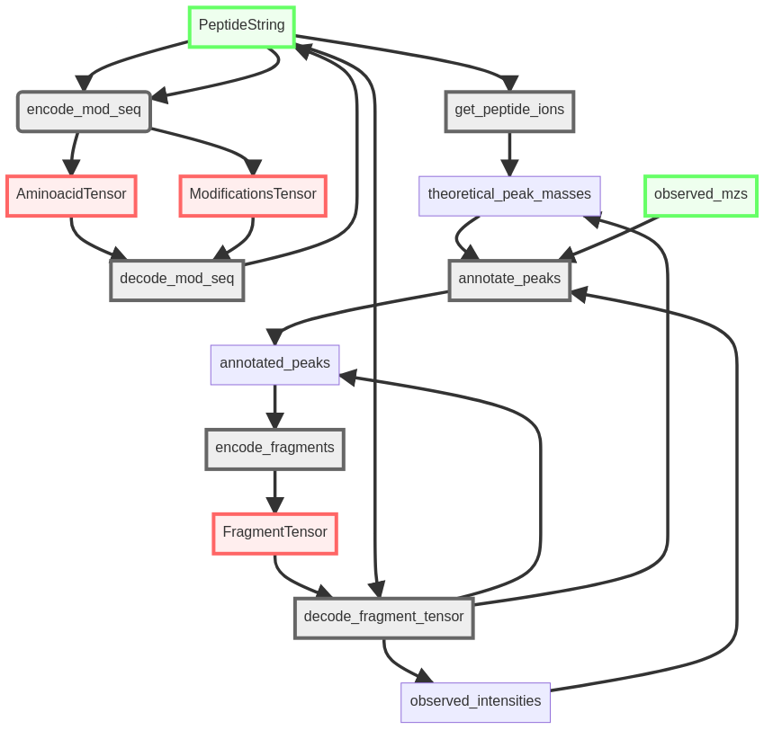

# From sequences and spectra to tensors

## Functions to annotate peaks as ions

::: elfragmentador.annotate

## Functions to encode and decode from sequences to tensors

::: elfragmentador.encoding_decoding
